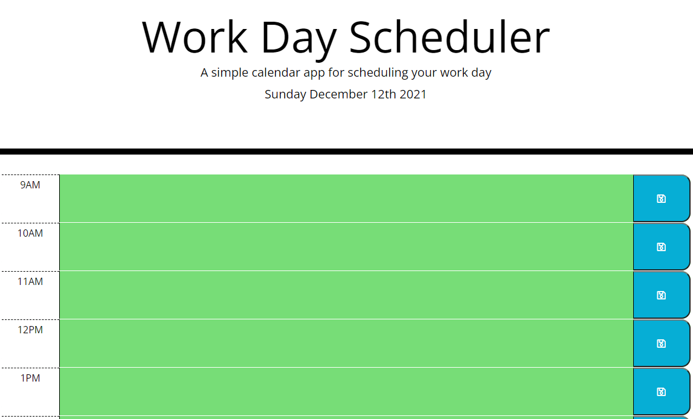

 </a>

<h3 align="center">Work Day Scheduler</h3>

---

## 

- [About](#about)
- [Usage](#usage)
- [Built With](#built_using)
- [Authors](#authors)
- [Questions](#questions)
- [Screenshots](#screenshots)

## 

Work Day Scheduler is an application to help user keep track of tasks for the day by showing the hour blocks as past, present, and future.

## 

To use Work Day Scheduler simply click on the time block desired, enter your task, and click on the save button. If the text area is gray the task is past due. If the text area is red the task is the present task. If the text area is green it is a future task. To delete a task simply click on the desired task to be deleted, use backspace key to delete text, click the save button.

## 

- HTML
- CSS
- Javascript

## 

[glenluersman](https://github.com/glenluersman)

## 

- Feel free to open an issue or contact me directly at glen.luersman@gmail.com if you have any questions about the repo. You can find more of my work at [glenluersman](https://github.com/glenluersman/).

## 

</a>
